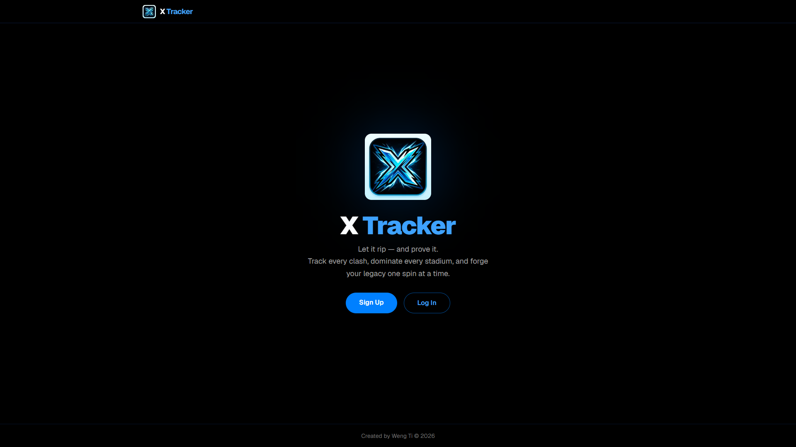
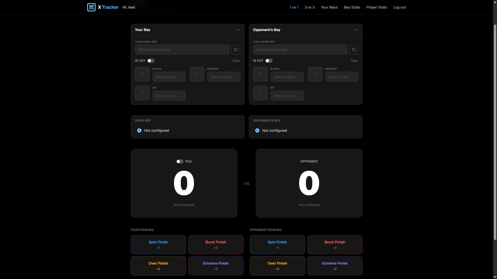
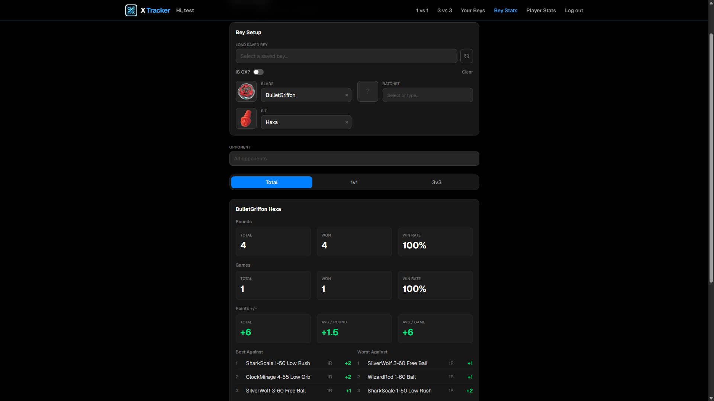
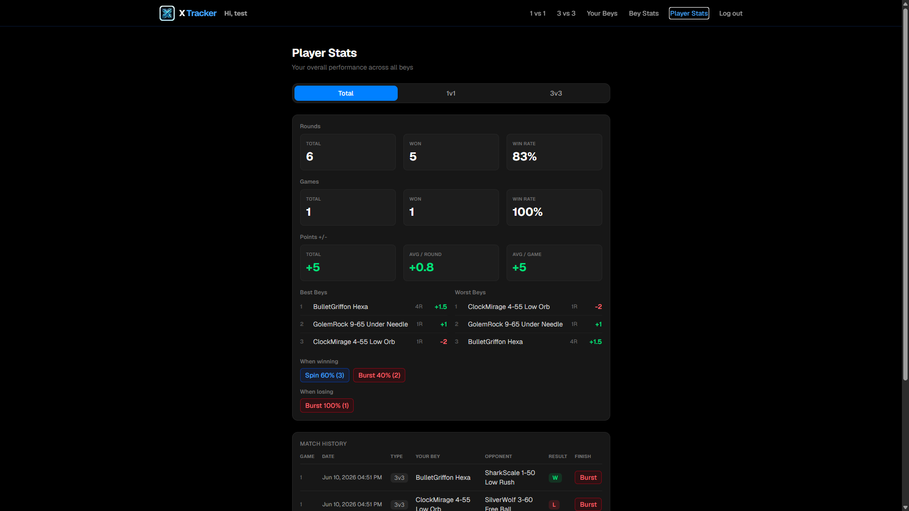

# X Tracker
X Tracker is a battle tracking tool for Beyblade X players to log matches, analyse Beyblade performance, and review personal statistics across 1v1 and 3v3 formats.



## Get Started
* Live Implementation: http://\<your-ec2-public-ip\>
* Demo Video: https://www.youtube.com/watch?v=jagw5ZUJa2I

## Tech Stack
| Layer | Technology |
| ----- | ---------- |
| Frontend | Next.js + TypeScript |
| Styling | TailwindCSS |
| Backend | Go + Gin |
| Authentication | JWT + httpOnly Cookie |
| JWT Blocklist | Redis |
| Database | SQLite |
| Deployment | AWS EC2 |

## Project Structure
```
/
├── frontend/           # Next.js app
│   └── src/
│       ├── app/        # Pages (1vs1, 3vs3, profile, bey-stats, player-stats)
│       ├── components/
│       ├── lib/
│       └── types/
├── backend/            # Go + Gin
│   ├── main.go
│   ├── handlers/
│   ├── auth/
│   ├── db/
│   ├── middlewares/
│   └── seeds/
├── scraper/            # Python scraper used to collect parts data from the Beyblade Wiki
├── Note.md             # Technical notes and learnings
└── deployment-guide.md
```

## What is Beyblade X?
Beyblade X is a competitive spinning top game where players assemble a Bey from interchangeable parts and battle in a stadium. X Tracker records those battles to build a data-driven picture of each Bey's performance over time.

Each Bey is assembled from up to 7 parts:

| Part | Role |
| ---- | ---- |
| Blade | Top layer — defines the attack pattern |
| Metal Blade | Reinforcement ring for additional weight |
| Over Blade | Outer layer for increased contact range |
| Assist Blade | Inner support layer |
| Lock Chip | Core connector piece |
| Ratchet | Height and angle of attack (format: count-height, e.g. 3-60) |
| Bit | The tip — determines movement type |

**CX (Counter Cross)** is a special assembly mode that replaces the standard blade stack with a unified CX piece, unlocking a different subset of available blades.

## Scoring: Finish Types
In Beyblade X, the finish type of each round determines how many points are awarded to the winner of that round:

| Finish | Points | Description |
| ------ | ------ | ----------- |
| Spin Finish | +1 | Opponent's Bey stops spinning first |
| Burst Finish | +2 | Opponent's Bey physically bursts apart |
| Over Finish | +2 | Opponent's Bey is knocked out of the stadium |
| Extreme Finish | +3 | Opponent's Bey exits via the X-Line rail surrounding the stadium |

In a 3v3 match, each player fields 3 Beys and points accumulate across rounds until one player reaches the winning threshold.

## Key Features

### 1v1 & 3v3 Battle Tracker
Configure your Bey and your opponent's Bey by selecting parts (or loading a saved Bey). Click the finish type buttons to increment the score round by round, then submit to record the result.

In 3v3 mode, each player fields 3 Beys. A finish history table builds up below the scoreboard as each round is played. On submission, the app records both the overall 3v3 match and each individual round as a 1v1 entry, so all stats stay consistent.



### Bey Stats
Look up any Bey (by Blade + Bit combination) and see its full performance breakdown: total rounds and games played, win rate, points scored, best and worst opponent matchups. Filterable by a specific opponent Bey to drill into head-to-head records.



### Player Stats
A personal dashboard showing overall win rate, points average, best and worst performing Beys, finish type tendencies when winning and losing, and a full paginated match history log.



### Your Beys (Profile)
Save frequently used Bey configurations so they can be loaded instantly in the battle tracker instead of re-selecting all 7 parts each time.

## Database Schema
| Table | Purpose |
| ----- | ------- |
| `parts` | All available Bey parts, seeded from JSON files in `backend/seeds/` on startup |
| `users` | User accounts (email + bcrypt-hashed password) |
| `matches_1v1` | Individual round results — linked to a `matches_3v3` row when applicable |
| `matches_3v3` | 3v3 game results with full part composition for all 6 Beys |
| `saved_beys` | User's saved Bey configurations |

The SQLite database file (`x-tracker.sql`) is auto-created and seeded on first run. Parts data (259 entries across 7 part types) is scraped from the Beyblade Wiki using the Python scraper in `scraper/`.

## Frontend Architecture
The frontend is a multi-page Next.js app where each route lives under `src/app/`. Route protection is handled centrally by a Next.js middleware (`middleware.ts`) that reads an httpOnly cookie to determine whether the user is authenticated before granting access to protected pages.

In development, the frontend targets the backend directly at `NEXT_PUBLIC_API_URL` (e.g. `http://localhost:8080`). In production this variable is intentionally left unset, so all API calls use relative URLs which Nginx routes to the backend transparently.

## Backend Architecture
The backend is a Go/Gin HTTP server. All protected routes sit behind a JWT middleware that validates the token signature, checks expiry, and verifies the token has not been explicitly logged out via the Redis blocklist.

```
GET    /parts                → return all parts (seeded on startup)
POST   /auth/signup
POST   /auth/login           → issues httpOnly JWT cookie
POST   /auth/logout          → invalidates JWT in Redis, clears cookie

--- protected (requires valid JWT cookie) ---
POST   /matches/1v1
POST   /matches/3v3
GET    /profile/beys
POST   /profile/bey
DELETE /profile/bey/:id
GET    /stats/bey
GET    /stats/player
```

## Deployment Architecture
```
Internet :80
    └── Nginx
         ├── /auth/, /parts, /matches/, /profile/bey, /stats/, /ping
         │       └── Go/Gin backend :8080
         └── everything else
                 └── Next.js frontend :3000

Redis :6379  (local only, not exposed externally)
SQLite       (auto-created at backend/x-tracker.sql on first run)
```

Deployed on an AWS EC2 `c7i-flex.large` (2 vCPU, 4 GB RAM) instance running Ubuntu 26.04 LTS. See [deployment-guide.md](deployment-guide.md) for the full step-by-step instructions covering Redis setup, CGO build requirements, Go version matching, and Nginx configuration.

## Technical Takeaway
Several non-trivial backend patterns are documented with full code walkthroughs in [Note.md](Note.md):

**JWT Expiry Validation** — how `golang-jwt/jwt/v5` validates the `exp` claim automatically during `jwt.Parse`, and why `WithExpirationRequired()` is needed to reject tokens with no expiry at all.

**httpOnly Cookie Authentication** — why setting the JWT from the backend via `Set-Cookie` with the `HttpOnly` flag is more secure than `localStorage` or a JS-readable cookie. Covers CORS `credentials: "include"`, `SameSite` policy, and the `Secure` flag toggle between HTTP and HTTPS.

**Redis JWT Blocklist** — JWT tokens are stateless and remain cryptographically valid until `exp`, meaning a logged-out token stays usable for up to 7 days. The blocklist stores the `jti` (JWT ID) of each logged-out token in Redis with a TTL equal to the token's remaining lifetime. Redis auto-evicts expired entries, and the store survives server restarts — unlike an in-memory `sync.Map`.

**Multi-join SQL query** — fetching a saved Bey's readable part names requires joining the same `parts` table 7 times with different aliases, since each of the 7 part slots is a separate foreign key pointing into the same table.

## Possible Future Improvements
* Leaderboard across multiple registered users
* Tournament bracket mode
* Opponent tracking — link matches to another registered user rather than entering their Bey manually
* Export match history to CSV
